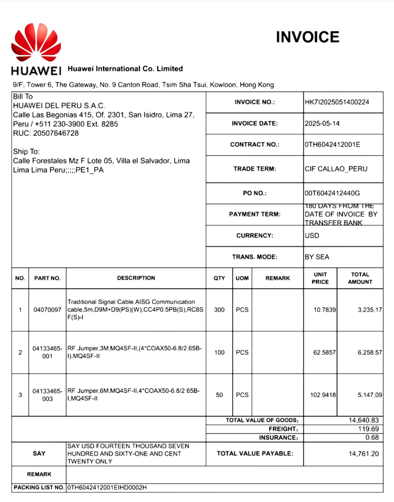

# Compréhension du Métier (Business Understanding)

## Contexte du Projet
Le commanditaire est une entreprise SaaS ERP spécialisée dans le secteur douanier au Pérou, fournissant des services aux agents de fret, douanes, opérateurs logistiques et importateurs/exportateurs.

Les utilisateurs interfacés avec le système doivent saisir de nombreuses données techniques et commerciales sur les produits transitant par les ports, conformément aux exigences strictes de la législation douanière péruvienne. Actuellement, les entreprises doivent télécharger manuellement sur le SaaS toutes les factures justifiant l'importation du fret. Ce processus implique souvent le traitement de volumes importants (d'une seule à des centaines de factures par interaction).

Ces factures servent de déclencheur critique pour l'exécution de divers rapports réglementaires internes, tels que la détection de catégories de produits importés, la somme des importations et le calcul des quantités. Le processus manuel actuel est jugé **fastidieux, lent et sujet aux erreurs humaines**.

## Problématique Actuelle
L'organisation a précédemment tenté d'automatiser ce flux en implémentant une solution OCR basée sur un outil de Deep Learning (Google Document AI). Bien que les résultats des tests initiaux (`proof of concept`) fussent prometteurs, la mise en production a révélé des défaillances majeures:

+   **Sur-apprentissage (Overfitting)** : Le modèle ne généralisait pas bien aux nouvelles factures ou aux variations mineures (off-setting).

+   **Coût de maintenance prohibitif** : Nécessité de ré-entraîner le modèle pour chaque nouveau client intégrant la plateforme. Ce processus de ré-entraînement prenait jusqu'à une demi-journée par client, sans garantie de succès pour le client suivant.

## Objectifs du Projet (Business Objectives)
Face à ces échecs, les objectifs du nouveau projet sont clairs :

1.  **Automatisation Robuste** : Disposer d'une solution capable de lire les factures de manière automatisée sans nécessiter de ré-entraînement constant.

2.  **Haute Précision** : Garantir une fiabilité élevée dans l'extraction des données critiques.

3.  **Réduction des Coûts** : Obtenir des coûts opérationnels inférieurs à ceux de l'outil Document AI actuel.

4.  **Performance (SLA)** : Respecter un niveau de service strict : **traiter 50 factures en moins de 5 minutes**, quel que soit le nombre de pages.

5.  **Polyvalence** : Gérer efficacement l'hétérogénéité des formats et des langues.

## Situation Technique
La solution doit être déployée sur **Google Cloud Platform (GCP)** et être conçue pour être escalable. Le projet dispose actuellement d'un jeu de données de vérité terrain (Ground Truth) de taille petite à moyenne pour valider la nouvelle approche.

# Compréhension des Données (Data Understanding)

## Nature des Données
Les documents d'entrée sont exclusivement des fichiers PDF. Cependant, leur origine varie grandement :

*   Documents natifs numériques.
*   Documents numérisés (scans) ou photographiés.
*   **Hétérogénéité** : Une grande diversité de mises en page (layouts) et de langues, reflétant la nature internationale du commerce logistique.

## Structure des Données Cibles
Le modèle doit extraire les informations structurées selon un schéma JSON précis, aligné avec les besoins de l'ERP douanier. Voici un exemple de la structure attendue :

| Champ | Description |
| :--- | :--- |
| `supplier_name` | Nom de l'entité émettrice de la facture. |
| `invoice_id` | Identifiant unique du document. |
| `invoice_date` | Date d'émission de la facture. |
| `currency` | Devise utilisée pour la transaction. |
| `total_amount` | Montant total à payer. |
| `line_items` | Liste des articles ou services facturés (description, quantité, prix). |


{width=50%}

```json
{
  "supplier_name": "Huawei International Co. Limited", 
  "invoice_id": "HK7l2025051400224", 
  "invoice_date": "2025-05-14",
  "line_items": [
    {
      "description": "Traditional Signal Cable, AISG Communication cable, 5m...", 
      "quantity": "300", 
      "amount": "3,235.17"
    }, 
    {
      "description": "RF Jumper, 3M, MQ4SF-II, (4*COAX50-6.8/2.65B-I)...", 
      "quantity": "100", 
      "amount": "6,258.57"
    }
  ]
}
```

# Préparation des Données (Data Preparation)

## Ground Truth

La constitution du jeu de données de référence (*Ground Truth*) a représenté l'un des défis majeurs du projet. Initialement, les modèles ont montré des performances insatisfaisantes en raison de plusieurs incohérences critiques identifiées dans les données d'origine :

*   **Diversité des formats de date** : Présence de formats très hétérogènes (dates écrites en toutes lettres, formats numériques variés), ce qui a complexifié la phase de validation automatique.
*   **Incomplétude et fragmentation des articles** : Certains articles présentaient des descriptions sur une ligne et des prix sur une autre, ou encore plusieurs descriptions fragmentées pour un même produit.
*   **Défis de standardisation** : Face à ces obstacles, une étape de standardisation rigoureuse a été nécessaire pour établir une base de données d'exemple cohérente.

Des efforts sont actuellement poursuivis pour affiner ce corpus afin de garantir un niveau de fiabilité optimal pour les phases d'entraînement et d'évaluation.

Voici un exemple du format JSON standardisé ciblé :

```json
{
  "line_items": [
    {
      "description": "Câble de communication AISG",
      "quantity": "300",
      "amount": null 
    },
    {
      "description": null,
      "quantity": null,
      "amount": "3,235.17"
    }
  ]
}
```

## État actuel du Pipeline de Données
Actuellement, aucune étape automatisée de nettoyage ou de prétraitement des fichiers PDF entrants n'a été mise en place en amont. Les documents sont stockés en l'état, ce qui constitue un obstacle pour les modèles d'IA, car la qualité visuelle brute d'un scan impacte directement le taux de succès de l'OCR.

## Fondamentaux du Nettoyage d'Images
Pour pallier ce manque, une couche de traitement d'image robuste basée sur **OpenCV** et **Pillow** a été introduite. Voici l'analyse détaillée des algorithmes implémentés et de leur justification technique :

*   **Upscaling Intelligent** :
    *   *Problème* : Certains scans arrivent en basse résolution (72 DPI), rendant les petits caractères illisibles pour l'OCR.
    *   *Solution* : Si la largeur de l'image est inférieure à 2000px, un redimensionnement avec l'algorithme de rééchantillonnage de Lanczos (`resize_if_small`) est appliqué, ce qui préserve mieux les détails des bords que l'interpolation bicubique standard.

*   **Denoising** : 
    *   *Problème* : Le "bruit poivre et sel" classique des scanners anciens crée des artefacts noirs isolés.
    *   *Solution* : Application d'un `MedianFilter`. Contrairement au flou gaussien qui "bave" les contours, le filtre médian élimine le bruit ponctuel tout en gardant les arêtes des lettres nettes.

*   **Deskewing** : 
    *   *Problème* : Une facture scannée avec une rotation de 3° suffit à chasser le texte hors des colonnes attendues pour l'extraction de tableaux.
    *   *Solution* : Détection de l'angle d'inclinaison via `cv2.minAreaRect` sur un masque binaire (`THRESH_OTSU`), suivie d'une rotation inverse.

*   **CLAHE** : 
    *   *Problème* : L'égalisation d'histogramme classique "brûle" les zones claires. Sur une photo de facture avec des ombres (ex: prise avec un smartphone), le contraste n'est pas uniforme.
    *   *Solution* : CLAHE améliore le contraste *localement* sur des tuiles (8x8 pixels), permettant de révéler du texte caché dans l'ombre sans surexposer le reste du document.

*   **Ajustements Colorimétriques** :
    *   Optimisation fine utilisant `ImageEnhance` pour maximiser le "Pop" du texte noir sur fond blanc, guidée par les hyperparamètres trouvés via Optuna.

## Stratégies de Prétraitement Implémentées

### Approche ML Traditionnelle (Optimisation Scientifique)
Plutôt que de définir ces paramètres de nettoyage arbitrairement ("au feeling"), une méthodologie rigoureuse d'optimisation bayésienne des hyperparamètres (HPO) a été adoptée en utilisant le framework **Optuna**.

Le pipeline exécute de multiples itérations ("trials") en faisant varier les paramètres pour maximiser une métrique objective : le **F1-Score** global de l'extraction.

*   **Paramètres optimisés** :
    *   Facteur de contraste (Range: 1.0 - 1.8)
    *   Facteur de luminosité (Range: 1.0 - 1.4)
    *   Taille du noyau de débruitage (Denoise Kernel: 1, 3, 5)
    *   Activation conditionnelle du CLAHE et du Deskewing (Booléen)

```{mermaid}
graph TD
    subgraph Optuna_Engine [Optuna HPO Engine]
        Sampler[TPE Sampler]
        Obj[Objectif: Maximize F1]
    end

    subgraph Preprocessing_Pipeline [Script: preprocessing_all.py]
        direction TB
        ImgIn[Input Image] --> DeNoise[Denoise Median]
        DeNoise --> DeSkew[Deskew Rotation]
        DeSkew --> Clahe[CLAHE Contrast Local]
        Clahe --> Resize[Lanczos Resize]
        Resize --> Bright[Brightness Contrast]
    end

    subgraph Evaluation [Evaluation Pipeline]
        OCR[OCR Model]
        Metric[Calcul F1 Score]
    end

    %% Flujo de trabajo con etiquetas entre comillas para evitar errores
    Sampler -- "1. Suggère Paramètres" --> Preprocessing_Pipeline
    Bright --> OCR
    OCR --> Metric
    Metric -- "2. Feedback Score" --> Obj
    Obj -- "3. Update Distribution" --> Sampler
    
    %% Estilos para que en el blog resalte
    style Optuna_Engine fill:#e1f5fe,stroke:#01579b
    style Preprocessing_Pipeline fill:#fff3e0,stroke:#e65100
    style Evaluation fill:#f1f8e9,stroke:#33691e
```

Cette approche transforme la configuration du pré-traitement d'un art subjectif en une science mesurable, garantissant que chaque filtre appliqué contribue statistiquement à la qualité du résultat final.

### Prémices d'un Agent IA de Prétraitement
Pour résoudre le manque de flexibilité de l'approche statique (qui applique les mêmes paramètres agnostiques à tous les documents), les bases de ce qui deviendra un **Agent IA de Prétraitement** ont été posées.

L'idée est de créer un système capable d'**évaluer d'abord la qualité visuelle** spécifique du document (luminosité, flou, biais) avant de décider dynamiquement des actions à entreprendre.

```{mermaid}
graph TD
    A[Facture PDF] --> B[Analyseur de Qualité]
    B --> C{Qualité OK ?}
    C -- Non --> D[Agent décide des transformations]
    D --> E[Appliquer Corrections Spécifiques]
    E --> B
    C -- Oui --> F[OCR Intelligent]
    F --> G[JSON]
```

La logique repose sur une boucle de feedback intelligente : tant que le score de qualité visuelle n'est pas optimal, l'agent itère sur les paramètres. Cela permet de traiter une photo sombre différemment d'un scan clair, là où l'approche traditionnelle échouerait sur l'un des deux.

# Modélisation (Modeling)

## Architecture du Pipeline
Le projet repose sur une architecture modulaire :

1.  **Ingestion**: Chargement depuis Google Cloud Storage (GCS).
2.  **Preprocessing**: OpenCV / Python.
3.  **Extraction (Modèles IA)** : voir section suivante.

## Analyse Comparative des Modèles OCR
Pour ce projet, plusieurs familles de modèles ont été évaluées afin de trouver l'équilibre optimal entre précision, coût et maintenabilité.

### 1. Typologie des Modèles
Deux catégories principales sont distinguées :

*   **OCR Traditionnel (ex: Tesseract)** :
    *   *Principe* : Analyse géométrique pixel par pixel pour identifier des caractères.
    *   *Avantages* : Gratuit, extrêmement rapide, s'exécute 100% en local (confidentialité totale), mature.
    *   *Limites* : "Aveugle" au contexte sémantique. Il peut lire "O" au lieu de "0" sans comprendre qu'il s'agit d'un prix. Nécessite souvent des expressions régulières (Regex) complexes pour structurer la donnée *a posteriori*.

*   **LLM Vision / Extracteurs (ex: Mistral, Llama, Gemini)** :
    *   *Principe* : Modèles de langage géants capables de "voir" (via un encodeur visuel ou un OCR intermédiaire) et de "comprendre" le document globalement.
    *   *Avantages* : Compréhension sémantique forte. Capacité à corriger une faute de frappe ("Totla" -> "Total") grâce au contexte. Sortie directe en JSON structuré prêt à l'emploi.
    *   *Limites* : Coût d'inférence (API), latence plus élevée, risque d'hallucination (inventer une donnée manquante).

### 2. Modèles Sélectionnés et Benchmarks
Trois modèles spécifiques ont été sélectionnés pour l'implémentation finale, excluant Google Document AI (propriétaire et "boîte noire") pour privilégier le contrôle et la flexibilité.

| Modèle | Type | Licence | Coût estimé / 1k pages | Vitesse | Précision Contextuelle |
| :--- | :--- | :--- | :--- | :--- | :--- |
| **Tesseract 5** | OCR Classique | Open Source (Apache 2.0) | **0.00 €** (CPU) | **Très Rapide** (<1s) | Faible (Nécessite Regex) |
| **Llama 3 (via Groq)** | LLM (Text-to-JSON) | Open Weights | Très Faible | Ultra Rapide (LPU) | **Excellente** |
| **Mistral 7B / Large** | LLM (Génératif) | Open Weights / API | Faible / Moyen | Moyenne | Très Bonne |

### 3. Justification du Choix Final
*   **Tesseract** a été conservé comme **Baseline** (référence de base). Il permet de valider si l'ajout d'une IA complexe apporte réellement de la valeur par rapport à une solution gratuite.
*   **Mistral** a été choisi pour sa robustesse en multilingue et sa facilité d'utilisation.
*   **Llama 3** (implémenté via l'accélérateur Groq) a démontré une capacité exceptionnelle à respecter le SLA de 5 minutes pour 50 factures grâce à son inférence ultra-rapide.

## Pipeline d'Inférence (Architecture End-to-End)
L'architecture globale de la solution est conçue pour être modulaire et scalable sur GCP, intégrant des techniques d'ingénierie logicielle avancées pour maximiser la performance.

### Workflow Complet
Le flux de données suit ces étapes clés :
1.  **Ingestion Asynchrone** : Récupération parallèle des PDF depuis le Bucket GCS via `asyncio`.
2.  **Pré-traitement (3 Modes)** :
    *   *None* : Image brute.
    *   *Standard* : Application de filtres basiques.
    *   *Intelligent (Optuna)* : Paramètres optimisés dynamiquement.
3.  **Inférence (Batch)** : Envoi optimisé des requêtes aux modèles (Mistral API, Groq) avec gestion de la concurrence pour minimiser la latence réseau.
4.  **Post-traitement et Validation** : Parsing, nettoyage Regex (pour Tesseract), et validation stricte du schéma JSON via Pydantic.
5.  **Output** : Stockage persistant des résultats validés.

### Optimisation de la Performance (SLA)
Pour atteindre l'objectif de **50 factures en < 5 minutes**, les mesures suivantes ont été implémentées :
*   **Concurrence Asynchrone** : Utilisation intensive de `Python asyncio` pour non-bloquer les I/O (lectures GCS, appels API).
*   **Parallélisme CPU** : Utilisation de `ProcessPoolExecutor` pour distribuer la charge lourde du traitement d'image (OpenCV) sur tous les cœurs disponibles.

```{mermaid}
graph LR
    subgraph Google_Cloud [GCP Infrastructure]
        GCS[(GCS Input Bucket)]
    end

    subgraph Core_Pipeline [Inference Engine]
        direction TB
        Pre[Pre-processing<br/>Asyncio + Multiprocessing]
        Router{Model Router}
        Mistral[Mistral API]
        Llama[Llama 3 / Groq]
        Tess[Tesseract Engine]
        Valid[JSON Validation<br/>Pydantic]
    end

    Output[(JSON Final)]

    GCS -- Async Fetch --> Pre
    Pre --> Router
    Router -- "Option A" --> Mistral
    Router -- "Option B" --> Llama
    Router -- "Option C" --> Tess
    Mistral --> Valid
    Llama --> Valid
    Tess --> Valid
    Valid --> Output
    
    style Core_Pipeline fill:#f9fbe7,stroke:#827717
    style Google_Cloud fill:#e3f2fd,stroke:#0d47a1
```

## Configuration des Services
La configuration est centralisée dans des fichiers `.env` et gérée par `pydantic` pour valider les schémas d'entrée/sortie.

# Évaluation (Evaluation)

## Méthodologie
L'évaluation repose sur MLflow pour le tracking des expériences.
Les métriques clés sont :
*   **Exact Match Rate (EMR)** pour les champs d'en-tête.
*   **F1 Score** pour les lignes produits (tolérance floue via `RapidFuzz`).
*   **Character Error Rate (CER)** pour mesurer la qualité de la transcription textuelle.

## Résultats du Benchmark
*(Insérer ici les graphiques générés par MLflow ou des tableaux de résultats)*

> Le modèle **[MODELE_GAGNANT]** a obtenu les meilleures performances avec un F1-Score global de **XX%**.

# Déploiement (Deployment)

## API REST (C9)
Le modèle sélectionné a été encapsulé dans une API REST développée avec **FastAPI**.
*   Endpoint: `POST /extract`
*   Entrée: Fichier PDF/Image
*   Sortie: JSON structuré

```python
@app.post("/extract")
async def extract_invoice(file: UploadFile):
    # Logique d'appel du modèle
    return {"data": extracted_json}
```

## Application Utilisateur
Une interface **Streamlit** permet aux utilisateurs finaux de :
1.  Uploader une facture.
2.  Visualiser les résultats extraits en temps réel.
3.  Corriger les erreurs éventuelles (Human-in-the-loop).

## Industrialisation

*   **Containerisation**: Utilisation de Docker pour packager l'application.
*   **CI/CD**: Pipeline de déploiement (théorique ou implémenté via GitHub Actions).
*   **Monitoring**: Suivi de la dérive du modèle via MLflow.

# Conclusion
Ce projet a permis de valider l'ensemble des compétences du référentiel RNCP37827BC02, du choix technologique jusqu'au déploiement d'une solution d'IA opérationnelle et monitorée.
