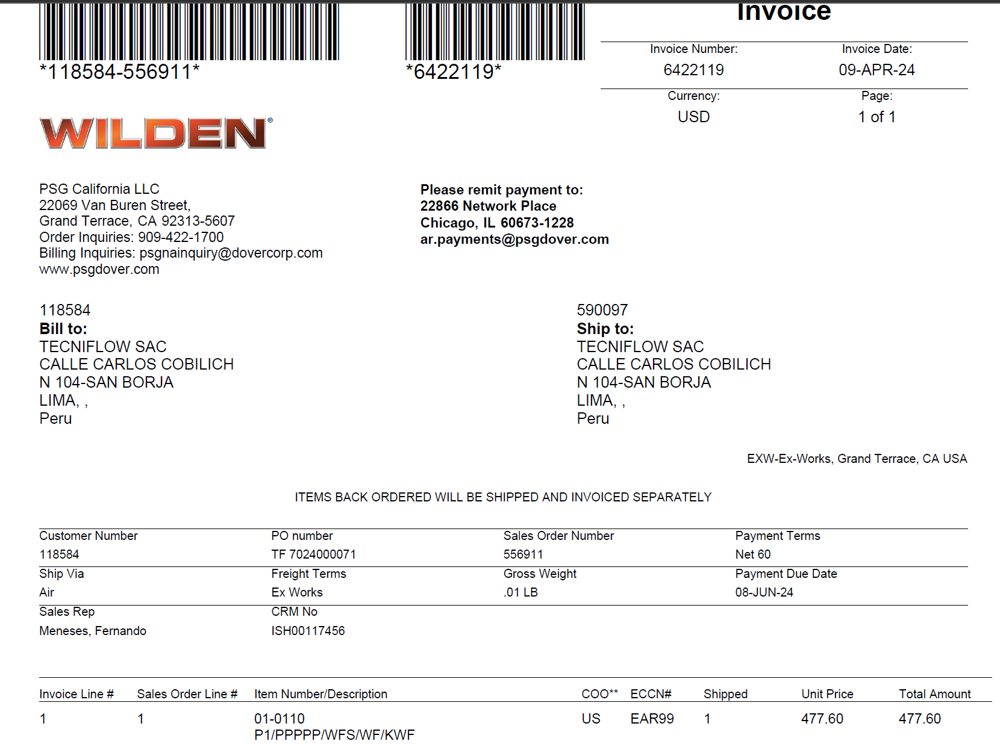
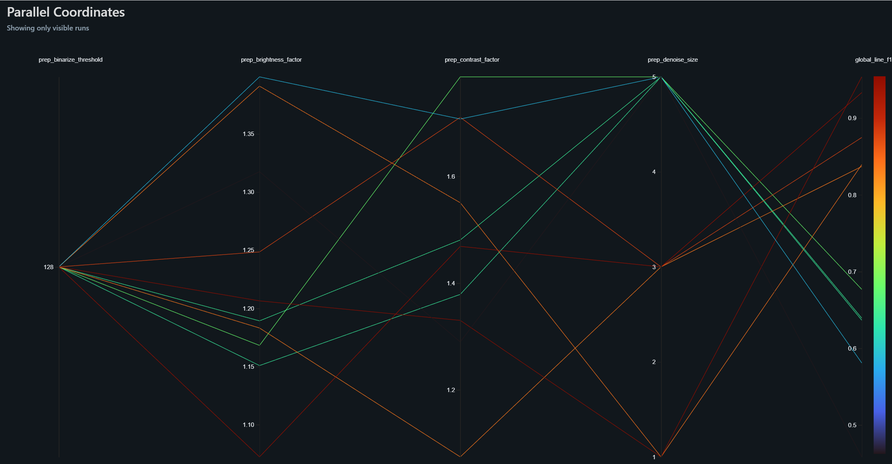
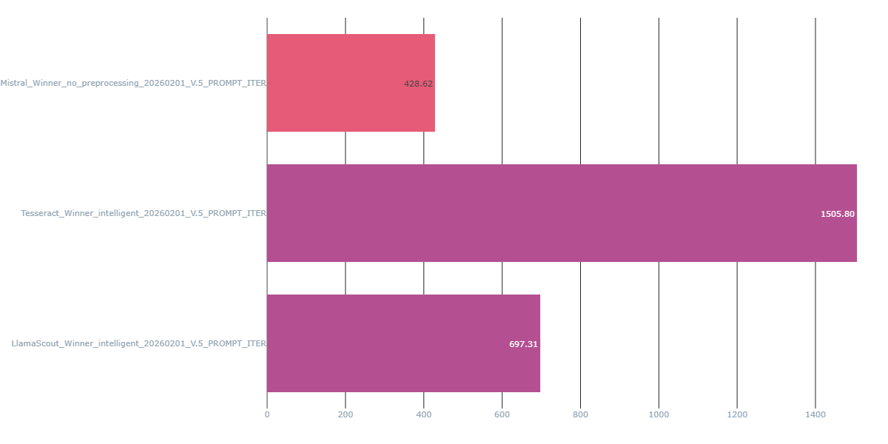
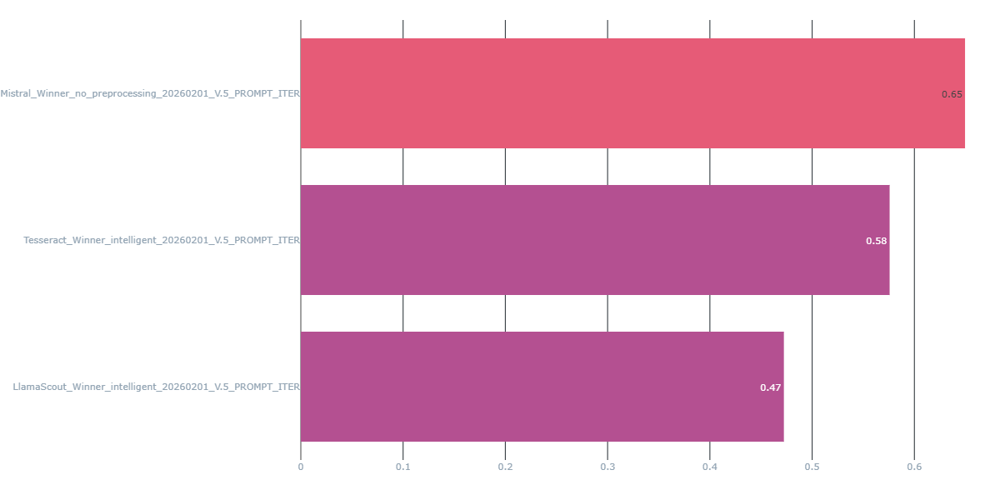

# Introduction {.center}

## Contexte du Projet

**Problématique Métier**
- Entreprise SaaS ERP dans le secteur douanier (Pérou)
- Traitement manuel de factures d'importation : **lent et sujet aux erreurs**
- Échec de la solution précédente (Google Document AI) : coûts élevés, sur-apprentissage

:::: {.columns}
::: {.column width="33%"}
{width=90%}  
:::
::: {.column width="33%"}
{width=90%}
:::
::: {.column width="33%"}
{width=90%}
:::
::::

::: {.notes}
- Expliquer le contexte business : besoin d'automatisation pour réduire les erreurs humaines
- Mentionner l'échec de Document AI pour justifier l'approche alternative
- Préparer la transition vers les objectifs
:::

## Objectifs Techniques

:::: {.columns}
::: {.column width="50%"}

**Performance**

- SLA : **50 factures < 5 min**
- Précision **> 90%**
- Formats hétérogènes
:::

::: {.column width="50%"}
**Économie**

- Réduction des coûts vs Document AI
- Flexibilité : aucun ré-entraînement par client
:::
::::

::: {.notes}
- Insister sur le SLA strict (exigence métier)
- Expliquer l'importance de la flexibilité (multi-clients, multi-formats)
- Transition : "Pour atteindre ces objectifs, deux phases ont été réalisées"
:::


# Partie 1/2: Cas Pratique {.center}
**Sélection et Paramétrage du Service IA**


## Dispositif de Veille Technologique

**Méthodologie de Recherche**

- Revues techniques : Medium, Kaggle
- Dépôts de modèles : **Hugging Face**, Linux Foundation
- Solutions testées :
  - Open Source : Tesseract, EasyOCR, **Docling (IBM)**
  - Modèles innovants : Llama Maverick, DeepSeek OCR
  - Solutions Cloud : Document AI, Mistral AI 

::: {.notes}
- Montrer la rigueur de la veille (sources multiples)
- Expliquer que plusieurs technologies ont été testées initialement
- Préparer la transition vers le benchmark structuré
:::


## Inventaire et Benchmark

| Type | Solution | Précision (F1) | Vitesse | Coût |
|------|----------|----------------|---------|------|
| **OS** | Tesseract | ~60% | Rapide | Gratuit |
| **VLM** | Llama 3 (Groq) | 90% | **Ultra-Rapide** | Faible |
| **VLM** | **Mistral** | **95%** | Moyenne | Moyen |

> **Décision** : Mistral retenu pour sa robustesse sur formats complexes

::: {.notes}
- Expliquer les critères de sélection (F1, Vitesse, Coût)
- Justifier pourquoi Mistral a été choisi malgré un coût plus élevé
- Mentionner que Tesseract est gardé comme baseline
:::


## Optimisation Scientifique du Parametres
:::: {.columns}
::: {.column width="40%"}
```{mermaid}
%%| fig-width: 12
graph TD
    Optuna[Optuna HPO Engine] -->|Suggère Paramètres| Prep[Pipeline Prétraitement]
    Prep -->|Image Optimisée| OCR[Modèle OCR]
    OCR -->|Résultats| Eval[Calcul F1-Score]
    Eval -->|Feedback| Optuna
    
    style Optuna fill:#e1f5fe,stroke:#01579b
    style Prep fill:#fff3e0,stroke:#e65100
    style Eval fill:#f1f8e9,stroke:#33691e
```
:::

::: {.column width="60%"}
{width=80%}
:::
::::

**Paramètres optimisés avec Optuna** : Contraste, Débruitage, CLAHE, Deskewing

::: {.notes}
- Expliquer qu'au lieu de paramètres arbitraires, on utilise une approche scientifique
- Optuna teste automatiquement des combinaisons pour maximiser le F1-Score
- Cela garantit que chaque filtre appliqué améliore statistiquement le résultat
:::


# Partie 2/2: Mise en Situation {.center}
**Industrialisation et Déploiement**

## Architecture Globale {.smaller}

:::: {.columns}
::: {.column width="65%"}
```{mermaid}
%%| fig-width: 10
graph TB
    subgraph GitHub
        Code[Code Source]
        Exp[Expérimentations]
    end
    subgraph MLflow [MLflow Cloud]
        Registry[Model Registry]
        Metrics[Métriques]
    end
    subgraph GCP
        API[FastAPI Backend]
        Frontend[Streamlit App]
    end
    
    Code -->|CI/CD| MLflow
    Exp -->|Log| MLflow
    MLflow -->|Load Model| API
    API -->|JSON| Frontend
    
    style MLflow fill:#e1f5fe
    style GCP fill:#fff3e0
```
:::

::: {.column width="35%"}
**Cycle de Vie MLOps**

- **GitHub** : Centralisation du code source.
- **MLflow** : Gestion du cycle de vie (Tracking & Registry).
- **GCP** : Infrastructure de production (Backend/Frontend).
- **Découplage** : L'API consomme uniquement les versions "Production".
:::
::::

::: {.notes}
- Expliquer le flux de travail MLOps
- GitHub pour le code, MLflow pour le tracking, GCP pour la production
- Seul le modèle "Production" dans MLflow est chargé par l'API
:::


## Structure Technique du Code

**Organisation Modulaire**

- `data_preprocessing/` : 3 stratégies (Baseline, Intelligent, Comprehensive)
- `models/` : Tesseract, Mistral, Llama
- `evaluations2.py` : Métriques rigoureuses (CER, WER, F1)
- `ocr_pipeline.py` : Wrapper MLflow (PythonModel)
- `api.py` : FastAPI + Chargement dynamique

::: {.notes}
- Montrer la séparation des responsabilités
- Chaque module a une fonction claire
- Le wrapper MLflow permet le versioning des modèles
:::
## Monitoring MLflow : Métriques Clés

**Métriques Alignées avec le Business**

1. **F1-Score global** : Indicateur de qualité (objectif > 90%)
2. **Latence P95** : Respect du SLA (< 6s/facture)
3. **Coût par 1000 factures** : Rentabilité vs Document AI

:::: {.columns}
::: {.column width="50%"}

:::

::: {.column width="50%"}

:::
::::

::: {.notes}
- Expliquer que MLflow n'est pas qu'un outil d'expérimentation
- Il sert aussi au monitoring en production
- Les graphiques permettent de comparer les runs et détecter les problèmes
:::

## Évaluation Rigoureuse {.smaller}

:::: {.columns}
::: {.column width="60%"}
**Métriques Complémentaires**

- **Accuracy** : Champs fixes (ID, date)
- **CER/WER** : Qualité de transcription textuelle
- **F1 Fuzzy Matching** : Tolérance aux variantes ("Câble" vs "Cable")
:::

::: {.column width="40%"}
**Défis Rencontrés**

- Fragmentation des articles
- Multilinguisme
- Ambiguïté sémantique
:::
::::

[Mlflow](https://mlflow-tracking-dev-642264350551.europe-west9.run.app){.btn .btn-primary role="button"}

::: {.notes}
- Montrer la complexité de l'évaluation sur des documents semi-structurés
- Expliquer pourquoi on utilise Fuzzy Matching (variantes orthographiques)
- Mentionner les défis techniques surmontés
:::

## API REST : Chargement Dynamique

**FastAPI + MLflow**

```python
MODELS_CACHE = {}

@app.post("/predict_mlflow")
async def predict_mlflow(file: UploadFile, model_uri: str):
    if model_uri not in MODELS_CACHE:
        MODELS_CACHE[model_uri] = mlflow.pyfunc.load_model(model_uri)
    
    model = MODELS_CACHE[model_uri]
    results = await run_in_threadpool(lambda: model.predict([file_path]))
    return {"results": results}
```

✅ **Agnostique du modèle** : changement de version sans redéploiement


::: {.notes}
- Expliquer le principe du cache pour éviter les rechargements
- Montrer que l'API peut charger n'importe quel modèle depuis MLflow
- Cela permet de changer de modèle sans toucher au code du backend
:::


## Intégration Streamlit

```{mermaid}
sequenceDiagram
    participant User
    participant Streamlit
    participant API
    participant MLflow
    
    User->>Streamlit: Upload PDF
    Streamlit->>API: POST /predict_mlflow
    API->>MLflow: Load Model
    MLflow-->>API: Model Object
    API->>API: predict(pdf)
    API-->>Streamlit: JSON Structured
    Streamlit->>User: Display + Filters
```


[FastAPI](https://ocr-backend-api-642264350551.europe-west9.run.app/docs){.btn .btn-primary role="button"}

::: {.notes}
- Montrer le flux complet de l'utilisateur final
- L'app Streamlit a été enrichie avec des pages de comparaison et de filtrage
- Démo prévue pendant la soutenance
:::


## Démonstration Prévue

**Composants à Démontrer**

1. ✅ Upload d'une facture via Streamlit
2. ✅ Appel API FastAPI + inspection JSON
3. ✅ Consultation MLflow (métriques de l'inférence)
4. ✅ Trigger de déploiement (Git Push → Cloud Run)

[Modele Runner](https://ocr-app-642264350551.europe-west9.run.app){.btn .btn-primary role="button"}

::: {.notes}
- Préparer la démo en direct
- Avoir une facture de test prête
- Montrer l'interface MLflow avec les runs précédents
- Si le temps le permet, montrer le déploiement automatique
:::

---

# Conclusion {.center}


## Impact et Perspectives

**Résultats Obtenus**

- SLA respecté : 50 factures en ~4.5 minutes ✅
- Précision : F1 > 95% (Mistral) ✅
- Coûts réduits vs Document AI ✅

**Évolutions Futures**

- Orchestration via Apache Airflow
- Amelioration Modele

::: {.notes}
- Montrer que le projet a atteint tous ses objectifs
- Proposer des évolutions réalistes et pertinentes
- Remercier le jury et ouvrir aux questions
:::


# Merci de votre attention {.center}

**Questions ?**

