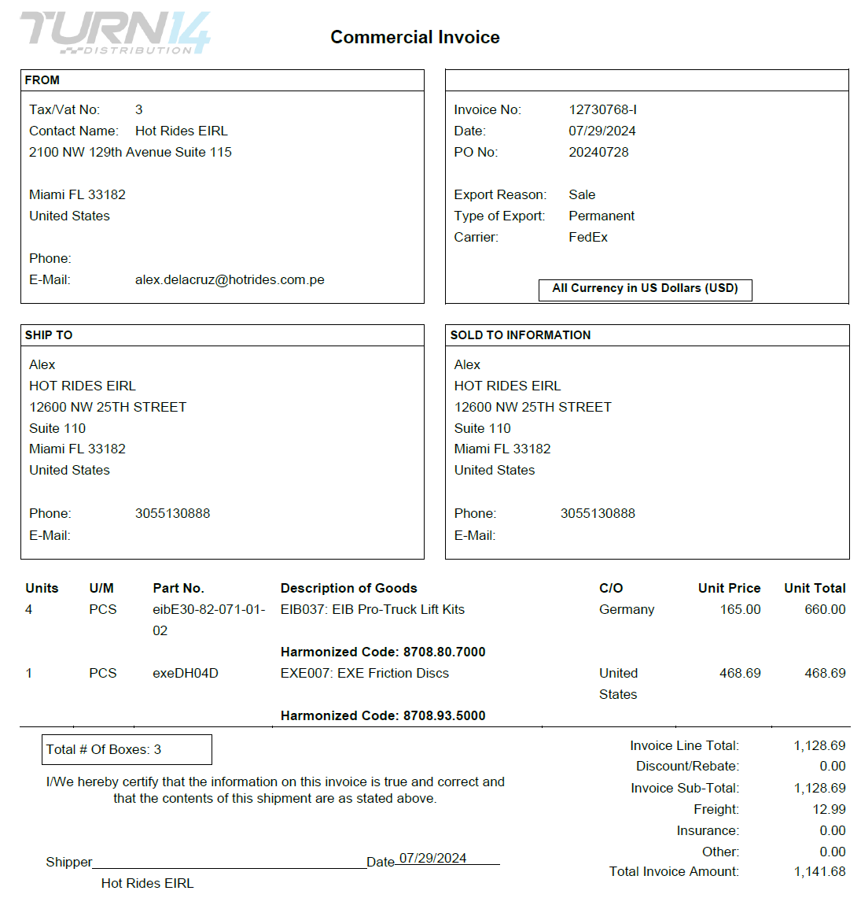
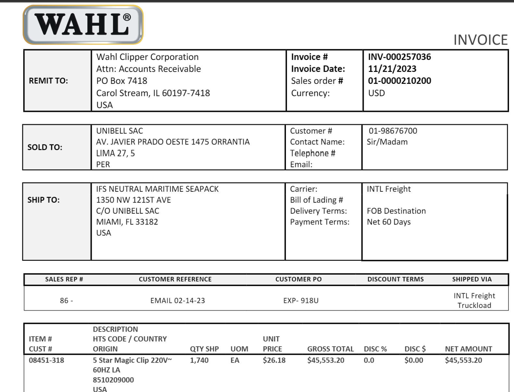

# Introduction {.center}

## Objetive du Projet

**Problématique Métier**

- Traitement manuel de factures d'importation : **lent et sujet aux erreurs**
- Automatization d'enregistrement du contenu des factures pour réduire les erreurs humaines et accélérer le processus


:::: {.columns}
::: {.column width="33%"}
{width=90%}  
:::
::: {.column width="33%"}
{width=90%}
:::
::: {.column width="33%"}
{width=90%}
:::
::::

# Demonstration {.center}

##  Pipeline Automatisé {.smaller .scrollable}

:::: {.columns}
::: {.column width="40%"}
### Flux Automatisé
Le pipeline gère l'ingestion de bout en bout :

```{mermaid}
%%| fig-width: 3
graph TD
    A(GCS) -->|PDF| B{Airflow}
    B -->|OCR| C[API]
    C -->|JSON| D[(BigQuery)]
    style B fill:#017cee,color:#fff
    style D fill:#4285F4,color:#fff
```

:::

::: {.column width="60%"}

*Le Dashboard Airflow permet de monitorer chaque étape du traitement.*
:::
::::

## 🖥️ Outil UI {.smaller .scrollable}

:::: {.columns}
::: {.column width="40%"}
### Interface Utilisateur
Permet de valider et monitorer les extractions :

- **Upload Direct** de factures
- **Visualisation** des données structurées

[Tester l'outil](https://ocr-app-642264350551.europe-west9.run.app/Model_Inference){.btn .btn-outline-primary role="button" .mt-4}
:::

::: {.column width="60%"}

:::
::::

# Architecture Globale {.center}

## Architecture Globale {.smaller .scrollable}

:::: {.columns}
::: {.column width="65%"}
```{mermaid}
%%| fig-width: 11
graph TB
    subgraph GitHub
        Code[Code, dbt & Models]
        Exp[Expérimentations]
    end

    subgraph MLflow [MLflow Cloud]
        Registry[Model Registry]
        Metrics[Métriques]
    end

    subgraph GCP [Google Cloud Platform]
        direction TB
        
        AF((Airflow Orchestrator))
        
        subgraph DataStack [Pipeline de Données]
            API[FastAPI OCR]
            BQ[(BigQuery)]
            DBT[[dbt Core]]
            VS[(Vector Store RAG)]
        end

        subgraph UX [Interface]
            Frontend[Streamlit App]
        end
    end

    %% Flux MLOps
    Code -->|CI/CD| MLflow
    Exp -->|Log| MLflow
    MLflow -->|Load Model| API
    
    %% Flux Data & Airflow
    AF -->|Orchestre| API
    AF -->|Sync| VS
    API -->|Raw Data| BQ
    BQ -->|Transform| DBT --> BQ
    
    %% Flux Utilisateur
    Frontend -->|Interroge / Chat| API
    API -->|Retrieve| VS
    API -->|Query| BQ
    
    style AF fill:#017cee,color:#fff
    style MLflow fill:#e1f5fe
    style DBT fill:#ff694b,color:#fff
    style GCP fill:#fff3e0,stroke:#e65100
    style VS fill:#f1f8e9
```
:::

::: {.column width="35%"}
**Cycle de Vie Intégré**

- **MLOps (MLflow)** : Gestion des versions du modèle et suivi des expérimentations GitHub.
- **Orchestration (Airflow)** : Pilotage du pipeline (OCR → BigQuery) et mise à jour du Vector Store.
- **Modern Data Stack** : Transformation via **dbt** pour l'analytique et indexation vectorielle pour le **RAG**.
- **Frontend** : Point d'accès unique pour l'analyse métier et le Q&A intelligent sur les factures.
:::
::::

::: {.notes}
- Expliquer le flux de travail MLOps
- GitHub pour le code, MLflow pour le tracking, GCP pour la production
- Seul le modèle "Production" dans MLflow est chargé par l'API
:::

## Intégration Streamlit

```{mermaid}
sequenceDiagram
    participant User
    participant Streamlit
    participant API
    participant MLflow
    
    User->>Streamlit: Upload PDF
    Streamlit->>API: POST /predict_mlflow
    API->>MLflow: Load Model
    MLflow-->>API: Model Object
    API->>API: predict(pdf)
    API-->>Streamlit: JSON Structured
    Streamlit->>User: Display + Filters
```


[FastAPI](https://ocr-backend-api-642264350551.europe-west9.run.app/docs){.btn .btn-primary role="button"}

::: {.notes}
- Montrer le flux complet de l'utilisateur final
- L'app Streamlit a été enrichie avec des pages de comparaison et de filtrage
- Démo prévue pendant la soutenance
:::

## Optimisation Scientifique du Parametres
:::: {.columns}
::: {.column width="40%"}
```{mermaid}
%%| fig-width: 12
graph TD
    Optuna[Optuna HPO Engine] -->|Suggère Paramètres| Prep[Pipeline Prétraitement]
    Prep -->|Image Optimisée| OCR[Modèle OCR]
    OCR -->|Résultats| Eval[Calcul F1-Score]
    Eval -->|Feedback| Optuna
    
    style Optuna fill:#e1f5fe,stroke:#01579b
    style Prep fill:#fff3e0,stroke:#e65100
    style Eval fill:#f1f8e9,stroke:#33691e
```
:::

::: {.column width="60%"}
{width=80%}
:::
::::

**Paramètres optimisés avec Optuna** : Contraste, Débruitage, CLAHE, Deskewing

::: {.notes}
- Expliquer qu'au lieu de paramètres arbitraires, on utilise une approche scientifique
- Optuna teste automatiquement des combinaisons pour maximiser le F1-Score
- Cela garantit que chaque filtre appliqué améliore statistiquement le résultat
:::


# Conclusion {.center}

## Impact et Perspectives

**Résultats Obtenus**

- SLA respecté : 50 factures en ~4.5 minutes ✅
- Précision : F1 > 95% (Mistral) ✅
- Coûts réduits vs Document AI ✅

**Évolutions Futures**

- Orchestration via Apache Airflow du RAG
- Ajouter dans le Cloud l'outil LightRAG
- Ajouter le processus DBT pour l'analytique

::: {.notes}
- Montrer que le projet a atteint tous ses objectifs
- Proposer des évolutions réalistes et pertinentes
- Remercier le jury et ouvrir aux questions
:::

# Annexe {.center}
**Sélection et Paramétrage du Service IA**


## Dispositif de Veille Technologique

**Méthodologie de Recherche**

- Revues techniques : Medium, Kaggle
- Dépôts de modèles : **Hugging Face**, Linux Foundation
- Solutions testées :
  - Open Source : Tesseract, EasyOCR, **Docling (IBM)**
  - Modèles innovants : Llama Maverick, DeepSeek OCR
  - Solutions Cloud : Document AI, Mistral AI 

[Mlflow](https://mlflow-tracking-dev-642264350551.europe-west9.run.app){.btn .btn-primary role="button"}

::: {.notes}
- Montrer la rigueur de la veille (sources multiples)
- Expliquer que plusieurs technologies ont été testées initialement
- Préparer la transition vers le benchmark structuré
:::


## Inventaire et Benchmark

| Type | Solution | Précision (F1) | Vitesse | Coût |
|------|----------|----------------|---------|------|
| **OS** | Tesseract | ~60% | Rapide | Gratuit |
| **VLM** | Llama 3 (Groq) | 90% | **Ultra-Rapide** | Faible |
| **VLM** | **Mistral** | **95%** | Moyenne | Moyen |

> **Décision** : Mistral retenu pour sa robustesse sur formats complexes

::: {.notes}
- Expliquer les critères de sélection (F1, Vitesse, Coût)
- Justifier pourquoi Mistral a été choisi malgré un coût plus élevé
- Mentionner que Tesseract est gardé comme baseline
:::

# Merci de votre attention {.center}

**Questions ?**

