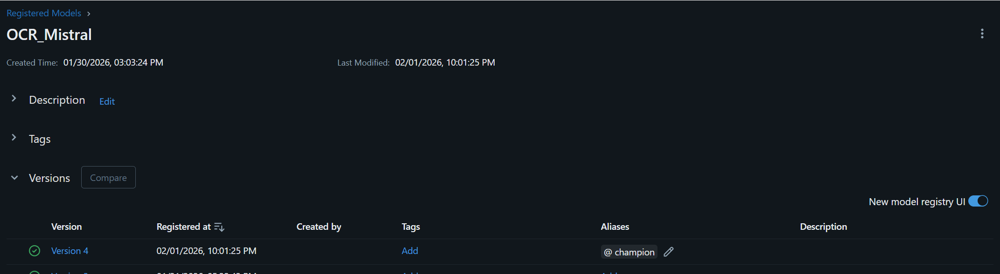
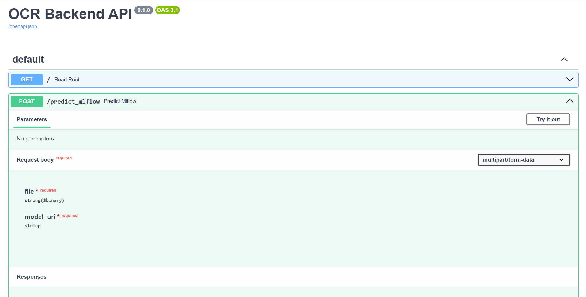

# Architecture Globale du Projet

## Vue d'Ensemble de l'Infrastructure

Le projet repose sur une architecture moderne combinant un dépôt de code versionné, un système de tracking d'expériences centralisé et un environnement de production scalable sur **Google Cloud Platform (GCP)**.

```{mermaid}
graph TB
    subgraph GitHub [Dépôt GitHub]
        Code[Code Source]
        Exp[Scripts Expérimentations]
        Params[Configs & Prompts]
    end

    subgraph MLflow_Cloud [MLflow Tracking Server]
        Registry[Model Registry]
        Metrics[Métriques & Artefacts]
        Runs[Historical Runs]
    end

    subgraph GCP [Google Cloud Platform]
        API[FastAPI Backend<br/>Cloud Run]
        Storage[GCS Bucket<br/>Documents]
        Frontend[Streamlit App<br/>Cloud Run]
    end

    Code -->|Push & CI/CD| MLflow_Cloud
    Exp -->|Log Experiments| MLflow_Cloud
    MLflow_Cloud -->|Load Best Model| API
    Storage -->|Input PDFs| API
    API -->|JSON Structured| Frontend
    
    style GitHub fill:#f9f9f9,stroke:#333
    style MLflow_Cloud fill:#e1f5fe,stroke:#01579b
    style GCP fill:#fff3e0,stroke:#e65100
```

## Flux de Travail MLOps

1.  **Phase Expérimentation** : Les data scientists ajustent les hyperparamètres de prétraitement et les prompts d'extraction dans le dépôt GitHub.
2.  **Logging Centralisé** : Toutes les métriques (F1, CER, latence, coûts) sont enregistrées automatiquement dans MLflow Cloud.
3.  **Déploiement Sélectif** : Seul le meilleur modèle (stage "Production" dans le Registry) est chargé par l'API FastAPI.


*(Image attendue : Capture d'écran montrant le Model Registry dans MLflow avec un modèle tagué "Champion")*

# Structure Technique du Code Source

Avant de détailler l'API, il est essentiel de comprendre l'organisation modulaire du code dans le dépôt `src/ocr_comparison/`.

```{mermaid}
graph TD
    Root[src/ocr_comparison/]
    
    Root --> Prep[data_preprocessing/]
    Root --> Models[models/]
    Root --> Eval[objects/evaluations2.py]
    Root --> Pipeline[ocr_pipeline.py]
    Root --> API[api.py]
    
    Prep --> PrepAll[preprocessing_all.py<br/>Optuna HPO]
    Prep --> Intelligent[intelligent_preprocessing.py<br/>Adaptative]
    
    Models --> Tess[tesseract_model.py]
    Models --> Mistral[mistral_model.py]
    Models --> Llama[llama_scout_model.py]
    
    Eval --> Metrics[Calcul CER, WER, F1<br/>Fuzzy Matching]
    
    Pipeline --> Wrapper[MLflow Wrapper<br/>PythonModel]
    
    style Root fill:#e8f5e9,stroke:#2e7d32
    style Prep fill:#fff3e0,stroke:#e65100
    style Models fill:#e3f2fd,stroke:#1565c0
    style Eval fill:#fce4ec,stroke:#c2185b
```

## Fonctions Clés par Module

| Module | Fonction Principale | Rôle |
| :--- | :--- | :--- |
| `preprocessing_all.py` | `apply_preprocessing()` | Applique les filtres OpenCV optimisés (CLAHE, Deskew). |
| `mistral_model.py` | `extract_invoice_data()` | Appelle l'API Mistral avec le prompt structuré. |
| `evaluations2.py` | `evaluate_extraction()` | Compare les prédictions avec le Ground Truth via métriques rigoureuses. |
| `ocr_pipeline.py` | Classe `OCRPipeline` | Wrapper MLflow héritant de `PythonModel` pour le versioning. |

# Développement de l'API REST

## Architecture FastAPI + MLflow

L'API a été conçue pour être **agnostique du modèle**, permettant de changer de version sans redéployer le code.

### Chargement Dynamique des Modèles

```python
import mlflow.pyfunc

# Cache pour éviter les rechargements
MODELS_CACHE = {}

@app.post("/predict_mlflow")
async def predict_mlflow(file: UploadFile, model_uri: str):
    if model_uri not in MODELS_CACHE:
        MODELS_CACHE[model_uri] = mlflow.pyfunc.load_model(model_uri)
    
    model = MODELS_CACHE[model_uri]
    results = await run_in_threadpool(lambda: model.predict([file_path]))
    return {"results": results}
```

### Gestion de l'Asynchronisme

L'utilisation de `nest_asyncio` permet d'exécuter des boucles événementielles imbriquées, nécessaire car certains modèles utilisent `asyncio.run()` en interne.

## Contrat d'Interface (Pydantic)

La validation stricte des schémas garantit que le JSON retourné est conforme à l'ERP client.

```python
class InvoiceItem(BaseModel):
    description: str
    quantity: Optional[int]
    amount: float

class InvoiceResponse(BaseModel):
    invoice_id: str
    date: date
    items: List[InvoiceItem]
```


*(Image attendue : Capture d'écran de l'interface /docs de FastAPI montrant les endpoints disponibles)*

# Intégration dans l'Application Streamlit

L'application Streamlit existante a été enrichie pour consommer les résultats de l'API.

## Flux d'Intégration

```{mermaid}
sequenceDiagram
    participant User
    participant Streamlit
    participant FastAPI
    participant MLflow
    participant Model

    User->>Streamlit: Upload PDF
    Streamlit->>FastAPI: POST /predict_mlflow
    FastAPI->>MLflow: Load Model (Cache)
    MLflow-->>FastAPI: Model Object
    FastAPI->>Model: predict(pdf)
    Model-->>FastAPI: JSON Structured
    FastAPI-->>Streamlit: Response
    Streamlit->>User: Display Results + Filters
```

## Interface Multi-Pages

L'application a été restructurée en pages indépendantes :

+ **Upload & Inference** : Envoi de documents et affichage des résultats.
+ **Model Comparison** : Tableau comparatif Pandas filtrable par champs.
+ **MLflow Dashboard** : Visualisation des runs directement dans Streamlit.


# Stratégie de Monitoring et Tests

## Métriques d'Évaluation Rigoureuses

Pour garantir la qualité du système, plusieurs métriques complémentaires ont été implémentées.

### Métriques au Niveau Document
*   **Exact Match Rate (EMR)** : Pourcentage de champs (invoice_id, date) parfaitement extraits.
*   **Accuracy** : Proportion globale de champs corrects.

### Métriques au Niveau Texte
*   **CER (Character Error Rate)** : Distance de Levenshtein normalisée au niveau caractère.
*   **WER (Word Error Rate)** : Distance au niveau mot, sensible aux erreurs de tokenisation.

### Métriques au Niveau Structurel (Line Items)
*   **Recall** : Proportion d'articles réellement présents qui ont été détectés.
*   **Precision** : Proportion d'articles détectés qui sont corrects.
*   **F1-Score avec Fuzzy Matching** : Utilisation de `RapidFuzz` pour tolérer les variantes orthographiques ("Câble AISG" vs "Cable AISG").

## Défis d'Évaluation Rencontrés

L'évaluation de documents semi-structurés comme les factures présente des défis uniques :

1.  **Fragmentation** : Un article peut être décrit sur plusieurs lignes.

2.  **Variabilité linguistique** : Multilinguisme (anglais, espagnol, chinois).

3.  **Ambiguïté sémantique** : "Total TTC" vs "Total" vs "Amount Due".

### Solution Adoptée
Un système de **matching par similarité sémantique** (Fuzzy Token Ratio > 80%) combiné à une validation de cohérence numérique (montants dans ±5%).

## Suivi MLflow en Production

Chaque inférence en production est tracée avec :

+   **Temps de latence** (objectif : < 6s/facture).
+   **Coût par requête** (API Mistral vs Groq).
+   **Métrique de confiance** (score interne du modèle).

Les graphiques MLflow permettent de détecter toute **dérive de performance** (Data Drift) lorsque de nouveaux formats de factures apparaissent.

### Métriques Prioritaires (Alignées avec le Business)

D'après les objectifs de l'entreprise (SLA < 5min, précision > 90%), les métriques suivantes sont surveillées en priorité :

1.  **F1-Score global** : Indicateur principal de qualité.
2.  **Latence P95** : 95% des requêtes doivent respecter le SLA.
3.  **Coût par 1000 factures** : Pour valider la rentabilité vs Document AI.


*(Image attendue : Graphique MLflow comparant le F1-Score de plusieurs runs expérimentaux)*

## Étapes Techniques 

1.  **Build** : Création de l'image Docker via le `Dockerfile.backend`.

2.  **Tests Automatisés** : Exécution de `evaluations2.py` sur un jeu de validation.

3.  **Déploiement GCP** : Poussée vers Cloud Run 

4.  **Monitoring Post-Déploiement** : Vérification des métriques de santé (Uptime, Error Rate).

## Infrastructure as Code (Terraform)

Les ressources GCP sont déclarées dans des fichiers `.tf` :

+ **GCS Bucket** pour les documents entrants.
+ **Service Account** avec permissions MLflow.
+ **Cloud Run Service** avec auto-scaling.

Cela garantit que l'environnement peut être recréé identiquement en cas de migration.

# Démonstration du Système Complet

La soutenance inclura une démonstration en direct couvrant :

1.  **Upload d'une facture** via Streamlit.
2.  **Appel de l'API FastAPI** et inspection du JSON retourné.
3.  **Consultation de MLflow** pour visualiser les métriques de cette inférence.
4.  **Trigger d'un déploiement** via Git Push (si le temps le permet).

# Ressources Complémentaires

Une documentation technique extensive du dépôt a été générée via une IA spécialisée (DeepWiki). Elle détaille la structure des paquets et les stratégies de prétraitement (Baseline, Intelligent, Comprehensive).

> [WARNING]
> Cette documentation est générée automatiquement par IA et peut contenir des approximations mineures, mais elle offre une vue exhaustive de l'architecture du code.

*   **Lien vers la Wiki** : [https://deepwiki.com/jeanluissoto/ocr_pipeline](https://deepwiki.com/jeanluissoto/ocr_pipeline)

# Retour à la Partie 1

Si vous avez manqué la sélection du modèle et l'optimisation des paramètres, vous pouvez revenir à la première partie :

[Partie 1/2 : Sélection et Paramétrage](index.qmd){.btn .btn-outline-primary role="button"}

# Conclusion

Ce projet illustre la mise en production complète d'un service d'IA, du développement de l'API à l'intégration dans une application métier, en passant par un système de monitoring robuste et une chaîne CI/CD automatisée. L'architecture choisie permet non seulement de satisfaire les besoins actuels mais offre également la flexibilité nécessaire pour les évolutions futures.
